# Jasper Meal Plan Multi-Step Workflow

## Visual Workflow Diagram

```mermaid
flowchart TD
    Start([User sends message:<br/>'Create 3-day meal plan']) --> Detect[Backend detects:<br/>is_meal_plan_request = True<br/>Time: t0]
    
    Detect --> DBQuery[Backend queries DB:<br/>Check conversation history<br/>for allergy info<br/>Time: t0 + δ]
    
    DBQuery --> Decision{Allergy info<br/>exists in DB?}
    
    Decision -->|No| NoAllergy[Backend:<br/>- Stores original request as pending<br/>- Builds messages array<br/>- Adds allergy reminder<br/>Time: t0 + δ]
    
    Decision -->|Yes| HasAllergy[Backend:<br/>- Merges original request + allergy info<br/>- Builds messages array<br/>- Adds proceed reminder<br/>Time: t0 + δ]
    
    NoAllergy --> API1[OpenAI API Call #1<br/>Time: t0 + δ → t0 + δ + Δ]
    HasAllergy --> API2[OpenAI API Call #2<br/>Time: t0 + δ → t0 + δ + Δ]
    
    API1 --> Response1[Jasper Response:<br/>'Before I create your meal plan,<br/>do you have any food allergies...?'<br/>Time: t0 + δ + Δ]
    
    API2 --> Response2[Jasper Response:<br/>Full meal plan generated immediately<br/>Time: t0 + δ + Δ]
    
    Response1 --> Store1[Backend stores response in DB<br/>Updates pending_allergy_info flag<br/>Time: t0 + δ + Δ]
    
    Response2 --> Store2[Backend stores response in DB<br/>Clears pending_allergy_info flag<br/>Time: t0 + δ + Δ]
    
    Store1 --> UserSees1[User sees allergy question]
    Store2 --> UserSees2[User sees full meal plan]
    
    UserSees1 --> UserResponse([User responds:<br/>'I am allergic to peanuts'<br/>Time: t1])
    
    UserResponse --> BackendProcess[Backend:<br/>- Detects allergy answer<br/>- Retrieves pending meal plan request<br/>- Combines request + allergy info<br/>- Updates DB<br/>Time: t1]
    
    BackendProcess --> BuildMessages[Backend builds messages array:<br/>- System prompt<br/>- Last 50 messages<br/>- Combined request<br/>- Proceed reminder<br/>Time: t1]
    
    BuildMessages --> API3[OpenAI API Call #2<br/>Time: t1 → t1 + Δ]
    
    API3 --> Response3[Jasper Response:<br/>Full meal plan generated<br/>3 meals + 3 snacks/day<br/>Serving sizes + calories<br/>Macros + micronutrients<br/>Allergens avoided<br/>Time: t1 + Δ]
    
    Response3 --> Store3[Backend stores response in DB<br/>Clears pending_allergy_info flag<br/>Time: t1 + Δ]
    
    Store3 --> Complete([User receives full meal plan<br/>Workflow complete])
    
    style Start fill:#e1f5ff
    style Complete fill:#d4edda
    style API1 fill:#fff3cd
    style API2 fill:#fff3cd
    style API3 fill:#fff3cd
    style Decision fill:#f8d7da
    style Response1 fill:#d1ecf1
    style Response2 fill:#d1ecf1
    style Response3 fill:#d1ecf1
```



### Enhanced Diagram with Timing Annotations (Production-Ready)

This version includes explicit timing annotations for async deployment on Render:

```mermaid
flowchart TD
    A[User sends message: "Create 3-day meal plan"\nTime: t0] --> B[Backend checks DB for pending_allergy_info\nTime: t0 + δ]
    
    B -->|No allergy info| C[Backend forces allergy question\nNO API CALL - Returns early\nTime: t0 + δ]
    B -->|Allergy info exists| D[Merge original request + allergy info; Insert proceed reminder\nTime: t0 + δ]
    
    C --> E[Store original request as pending in DB\nStore allergy question response\nTime: t0 + δ]
    D --> F[Build messages array for Jasper API call\nTime: t0 + δ]
    
    E --> H[User sees allergy question\nTime: t0 + δ]
    F --> G[Jasper API call #1\nTime: t0 + δ → t0 + δ + Δ]
    
    G --> I[Jasper generates full meal plan immediately\nTime: t0 + δ + Δ]
    
    H --> J[User responds with allergy info\nTime: t1]
    J --> K[Backend detects allergy answer\nRetrieves pending request from metadata\nTime: t1]
    K --> L[Backend combines request + allergy info\nBuilds messages array with proceed reminder\nTime: t1]
    L --> M[Backend sends Jasper API call #2\nTime: t1 → t1 + Δ]
    M --> N[Jasper generates full meal plan\n3 meals + 3 snacks/day\nServing sizes + calories\nMacros + micronutrients\nAllergens avoided\nTime: t1 → t1 + Δ]
    
    N --> O[Backend stores Jasper response in DB\nClears pending_allergy_info flag\nTime: t1 + Δ]
    O --> P[User receives full meal plan\nTime: t1 + Δ]
    
    I --> P2[User receives full meal plan\nTime: t0 + δ + Δ]
    
    %% API call styling
    classDef apiCall fill:#d1f2eb,stroke:#333,stroke-width:2px;
    classDef userAction fill:#e1f5ff,stroke:#333,stroke-width:1px;
    classDef dbAction fill:#fff3cd,stroke:#333,stroke-width:1px;
    classDef decision fill:#f8d7da,stroke:#333,stroke-width:1px;
    classDef noApiCall fill:#ffe6e6,stroke:#333,stroke-width:1px,stroke-dasharray: 5 5;
    
    class G,M apiCall;
    class A,J userAction;
    class B,E,K,O dbAction;
    class B decision;
    class C,E noApiCall;
```

### Timing Notation

- **t0**: Initial user request triggers backend logic
- **δ (delta)**: Minor backend processing time (DB checks, message building, typically < 100ms)
- **Δ (Delta)**: Jasper API call processing time (typically 2-5 seconds on Render)
- **t1**: User response with allergy info, triggers second API call

### Highlights

- **Separation of API calls**: API Call #1 asks for allergies or generates plan immediately; API Call #2 generates full meal plan using combined request + allergy info
- **Async timing explicit**: Perfect for Render deployment planning, avoiding race conditions, and QA checks for API call durations
- **Database operations**: All state changes stored in PostgreSQL before API calls
- **Color coding**: API calls (green), user actions (blue), DB operations (yellow), decisions (pink)

## Timing Breakdown

| Event | Time | Description |
|-------|------|-------------|
| **t0** | Initial request | User sends meal plan request |
| **t0 + δ** | Backend processing | DB query, intent classification, message building |
| **t0 + δ + Δ** | First API response | Jasper responds (allergy question OR meal plan) |
| **t1** | User response | User provides allergy information |
| **t1 + Δ** | Second API response | Jasper generates full meal plan |

## API Call Details

### API Call #1 (if no allergy info)

- **Trigger**: Initial meal plan request
- **Messages Array**:
  1. System prompt (meal_plan module)
  2. Last 50 conversation messages
  3. Current user message
  4. Allergy reminder instruction
- **Expected Response**: Allergy question

### API Call #2 (after allergy answer)

- **Trigger**: User provides allergy information
- **Messages Array**:
  1. System prompt (meal_plan module) + top priority instruction
  2. Last 50 conversation messages
  3. Combined request (original + allergy info)
  4. Proceed reminder (explicit: "CREATE THE MEAL PLAN NOW")
- **Expected Response**: Full meal plan

### API Call #2 (if allergy info already exists)

- **Trigger**: Initial meal plan request with existing allergy info
- **Messages Array**:
  1. System prompt (meal_plan module) + top priority instruction
  2. Last 50 conversation messages
  3. Combined request (original + allergy info)
  4. Proceed reminder
- **Expected Response**: Full meal plan immediately

## Database State Management

### State Variables

- `pending_meal_plan_request`: Original request stored in assistant message metadata
- `previous_asked_allergies`: Boolean flag indicating if allergy question was asked
- `is_allergy_answer`: Boolean flag indicating if current message is an allergy response
- `conversation_id`: Links all messages to the same conversation

### State Transitions

1. **Initial Request** → Store `pending_meal_plan_request` in metadata
2. **Allergy Question Asked** → Set `previous_asked_allergies = True`
3. **Allergy Answer Received** → Combine request + allergy, clear pending flag
4. **Meal Plan Generated** → Clear all pending flags

## Key Implementation Details

### Message Combination Logic

```python
# When allergy answer is detected:
combined_message = f"{pending_meal_plan_request}. {allergy_info}."
```

### System Prompt Enhancement

```python
# Top priority instruction prepended:
top_priority = """
🚨🚨🚨 ABSOLUTE TOP PRIORITY - READ THIS FIRST 🚨🚨🚨
THE USER'S MESSAGE BELOW IS A COMPLETE MEAL PLAN REQUEST WITH ALLERGY INFORMATION.
YOU MUST CREATE THE MEAL PLAN IMMEDIATELY.
DO NOT ACKNOWLEDGE. DO NOT EXPLAIN. DO NOT ASK QUESTIONS.
JUST CREATE THE MEAL PLAN. START WITH THE MEAL PLAN.
"""
```

### Proceed Reminder Message

```python
proceed_reminder = {
    "role": "user",
    "content": "I have provided my complete meal plan request above, which includes my original request plus my allergy information. CREATE THE MEAL PLAN NOW. DO NOT acknowledge the allergy. START YOUR RESPONSE WITH THE MEAL PLAN (Day 1, Breakfast:...)."
}
```

## Advantages of This Architecture

✅ **Clear Separation**: Allergy check happens before meal plan generation  
✅ **Persistent Memory**: All state stored in PostgreSQL  
✅ **Async-Safe**: DB updates prevent race conditions  
✅ **Render-Compatible**: Handles multi-second API calls gracefully  
✅ **Context Preservation**: Last 50 messages maintain full conversation context  
✅ **Modular Prompts**: Only meal_plan module loaded for meal plan requests  

## Error Handling

- **Missing Allergy Info**: System forces allergy question before meal plan
- **Allergy Answer Without Request**: System searches conversation history for original request
- **Validation Failures**: System injects correction prompts if meal plan doesn't meet requirements
- **API Failures**: Backend retries with exponential backoff

## Testing Checklist

- [ ] Test meal plan request without allergy info → Should ask about allergies
- [ ] Test allergy answer after question → Should generate meal plan immediately
- [ ] Test meal plan request with existing allergy info → Should generate immediately
- [ ] Test conversation history retrieval → Should include last 50 messages
- [ ] Test message combination → Should merge request + allergy naturally
- [ ] Test system prompt loading → Should load meal_plan module
- [ ] Test proceed reminder injection → Should prevent acknowledgments
- [ ] Test validation → Should catch missing calories, macros, days
