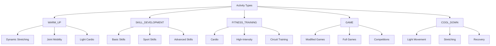
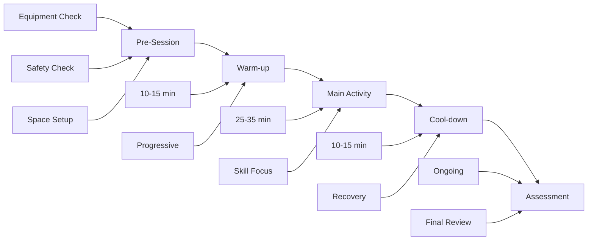
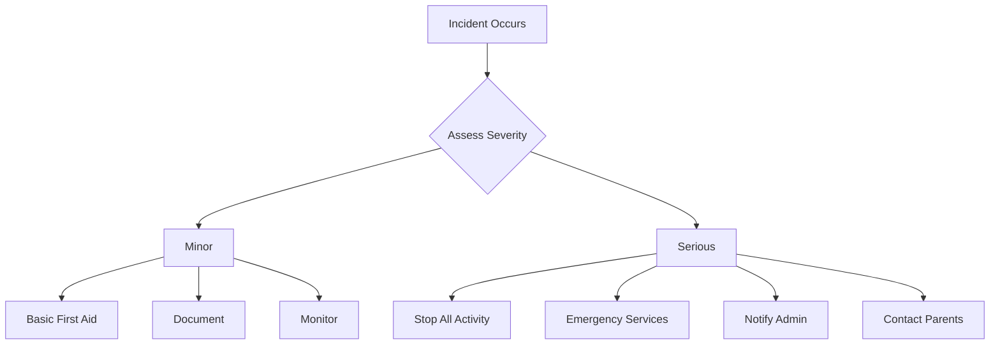
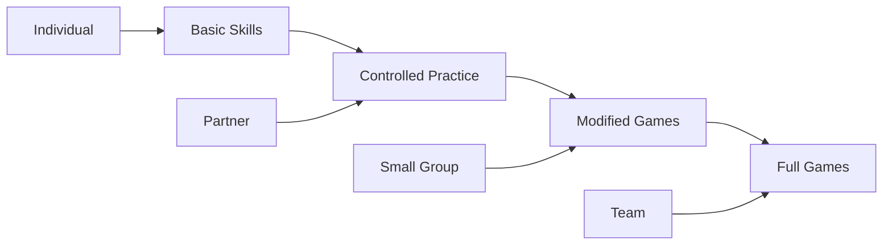
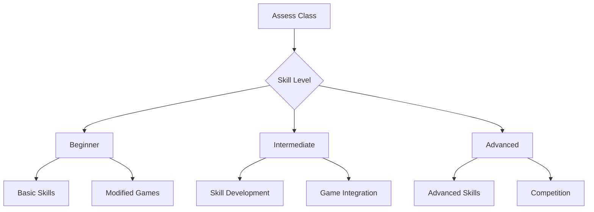

# Faraday PE System - Quick Reference Guide

## Activity Type Quick Reference



## Session Structure Flowchart



## Emergency Response Flowchart



## Quick Reference Tables

### Activity Selection Guide
| Type | Beginner | Intermediate | Advanced |
|------|-----------|--------------|-----------|
| Warm-up | Dynamic Warm-up (318) | Dynamic Movement Flow (346) | Sport Dynamic Preparation (347) |
| Skills | Basketball Dribbling (316) | Soccer Ball Control (350) | Advanced Basketball Skills (355) |
| Fitness | Circuit Training (320) | Progressive Running Intervals (336) | Advanced HIIT Circuit (348) |
| Game | Basketball Game (321) | Soccer Game Skills (351) | Volleyball Skill Progression (358) |
| Cool-down | Cool Down Stretches (319) | Complete Flexibility Program (352) | Advanced Flexibility Flow (353) |

### Activity Counts (Updated April 2024)
- Total Activities: 44
- Warm-up: 10 activities
- Skills: 18 activities
- Fitness: 4 activities
- Game: 3 activities
- Cool-down: 9 activities

### Safety Checklist
```
Pre-Activity:
□ Space Clear
□ Equipment Ready
□ First Aid Kit
□ Emergency Contacts
□ Communication Device

During Activity:
□ Student Monitoring
□ Equipment Check
□ Space Management
□ Time Management
□ Safety Cues

Post-Activity:
□ Equipment Storage
□ Student Check
□ Incident Report
□ Space Cleanup
□ Documentation
```

### Assessment Quick Guide
```
Skill Assessment:
1 - Beginning: Needs constant guidance
2 - Developing: Occasional guidance
3 - Proficient: Independent
4 - Advanced: Mastery

Participation:
1 - Minimal engagement
2 - Inconsistent
3 - Consistent
4 - Exemplary

Safety Compliance:
1 - Needs reminder
2 - Usually follows
3 - Consistently safe
4 - Helps others
```

## Common Modifications

### Space Adjustments
```
Smaller Space:
- Reduce player numbers
- Modify boundaries
- Adjust scoring zones
- Simplify movement

Larger Space:
- Add players
- Extend boundaries
- Include zones
- Complex movements
```

### Equipment Modifications
```
Basic:
- Lighter balls
- Shorter distances
- Lower targets
- Support aids

Advanced:
- Regulation equipment
- Full distances
- Standard targets
- No modifications
```

## Activity Progression Path



## Emergency Contacts Template
```
Quick Dial List:
1. Emergency: 911
2. School Office: ___________
3. Nurse: ___________
4. Security: ___________
5. Supervisor: ___________

Location Info:
- Building: ___________
- Room/Field: ___________
- Access Point: ___________
- AED Location: ___________
```

## Daily Setup Checklist
```
Morning Setup:
□ Facility inspection
□ Equipment check
□ Safety equipment
□ First aid kit
□ Emergency plans
□ Activity cards
□ Assessment tools

Between Classes:
□ Equipment reset
□ Space check
□ Safety scan
□ Documentation
□ Modifications

End of Day:
□ Equipment storage
□ Facility check
□ Incident reports
□ Next day prep
□ Documentation
```

## Common Teaching Cues

### Movement Cues
```
Balance:
- "Athletic stance"
- "Stable base"
- "Core tight"
- "Eyes level"

Movement:
- "Light feet"
- "Smooth motion"
- "Control speed"
- "Flow through"

Safety:
- "Space bubble"
- "Heads up"
- "Soft landing"
- "Stay aware"
```

## Activity Selection Flowchart



## Quick Troubleshooting Guide
```
Issue → Solution

Too Easy:
- Add complexity
- Increase speed
- Reduce space
- Add defenders

Too Hard:
- Simplify rules
- Slow pace
- More space
- Remove pressure

Low Engagement:
- Add competition
- Partner work
- Quick success
- More feedback

Safety Concerns:
- Review rules
- Modify space
- Adjust equipment
- Increase supervision
```

## Beta Documentation References

For detailed information about the beta program and its features, please refer to the following documentation:

- [Beta User Onboarding Guide](/docs/beta/beta_user_onboarding.md)
  - Account setup and configuration
  - Core features overview
  - Security features
  - Support and resources

- [Monitoring and Feedback Setup](/docs/beta/monitoring_feedback_setup.md)
  - System monitoring configuration
  - Performance metrics
  - Alert systems
  - Feedback collection

- [Beta Documentation](/docs/beta/beta_documentation.md)
  - Technical documentation
  - API references
  - Troubleshooting guides
  - Known issues and workarounds

- [Pre-Beta Checklist](/docs/beta/pre_beta_checklist.md)
  - Security validation
  - Performance testing
  - Documentation review
  - User acceptance testing

## Related Documentation

### Core Documentation
- [Activity System](/docs/activity_system.md)
  - Comprehensive activity list
  - Category hierarchy
  - Activity types and levels
  - Implementation guidelines

- [Visual Guides](/docs/visual_guides.md)
  - Activity category diagrams
  - Space setup visualizations
  - Circuit training layouts
  - Formation patterns

- [Assessment Framework](/docs/assessment_framework.md)
  - Detailed assessment rubrics
  - Progress tracking tools
  - Participation metrics
  - Reporting templates

- [Safety Protocols](/docs/safety_protocols.md)
  - Detailed safety guidelines
  - Risk management procedures
  - Emergency response protocols
  - Documentation requirements

- [Lesson Plans](/docs/lesson_plans.md)
  - Complete lesson templates
  - Unit planning guides
  - Teaching strategies
  - Modification techniques

### Implementation and Technical Details
- [Activity Visualization Manager](/docs/activity_visualization_manager.md)
  - Performance visualization tools
  - Data analysis features
  - Progress tracking visuals
  - Export capabilities

- [Dashboard Integration Context](/docs/context/dashboard-ai-integration-context.md)
  - System architecture
  - Implementation phases
  - Feature integration
  - Success metrics

- [Dashboard Handoff](/docs/handoff/dashboard_handoff.md)
  - System components
  - Security features
  - Performance metrics
  - Deployment guidelines

- [User System Implementation](/docs/handoff/user_system_implementation.md)
  - User management details
  - Security implementation
  - System integration
  - Database structure

### Beta Program Documentation
- [Beta Documentation](/docs/beta/beta_documentation.md)
  - Technical documentation
  - API references
  - Troubleshooting guides
  - Known issues

- [Monitoring Setup](/docs/beta/monitoring_feedback_setup.md)
  - System monitoring
  - Performance metrics
  - Alert systems
  - Feedback collection

- [User Onboarding](/docs/beta/beta_user_onboarding.md)
  - Quick start guide
  - Feature overview
  - Support resources
  - Training materials

- [Pre-Beta Checklist](/docs/beta/pre_beta_checklist.md)
  - Security validation
  - Performance testing
  - Documentation review
  - User acceptance testing