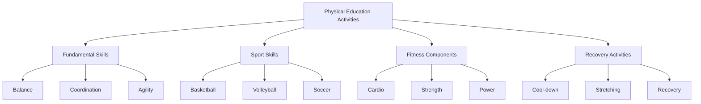
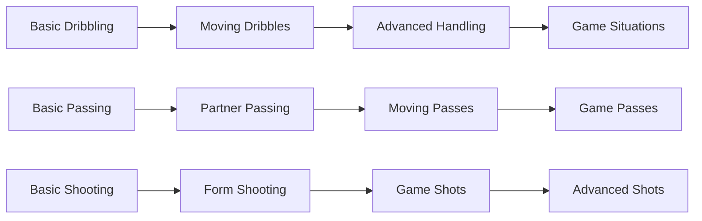
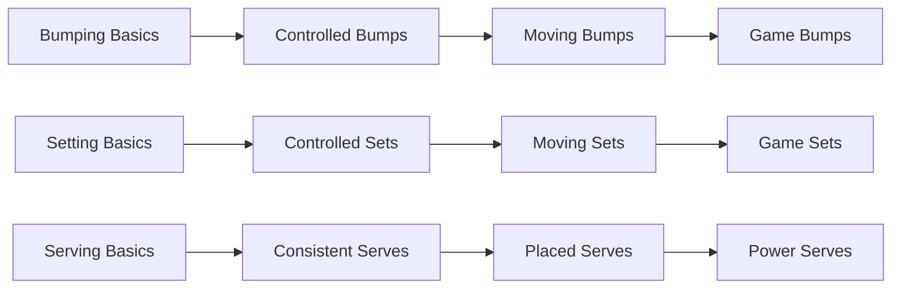
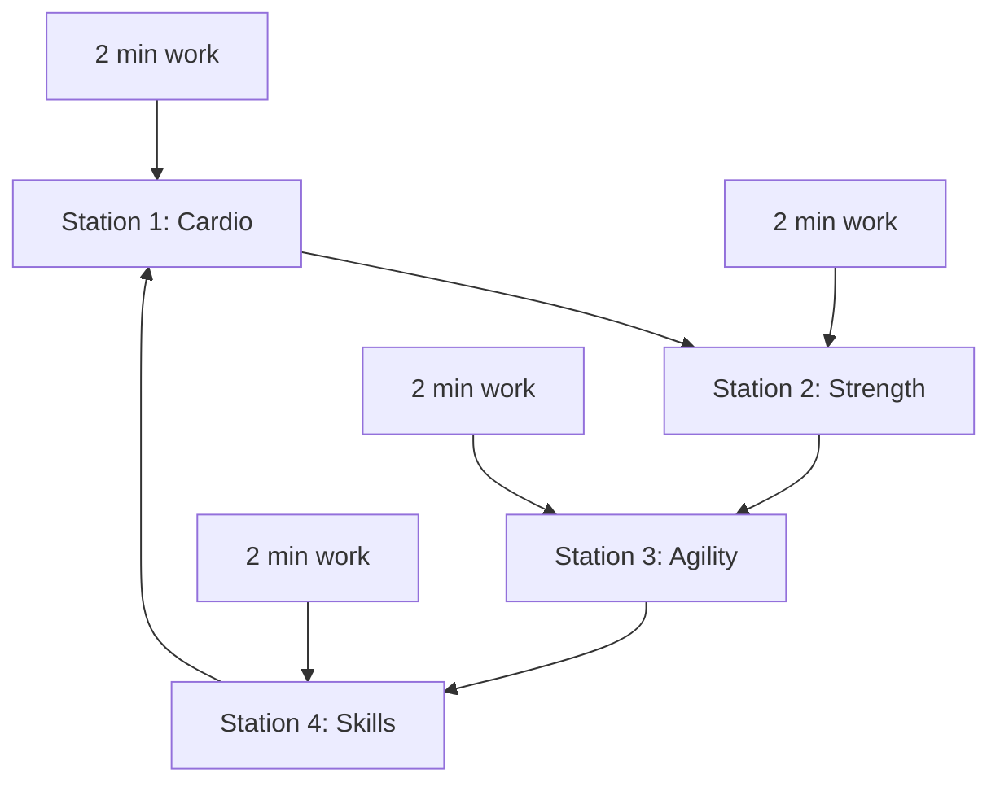
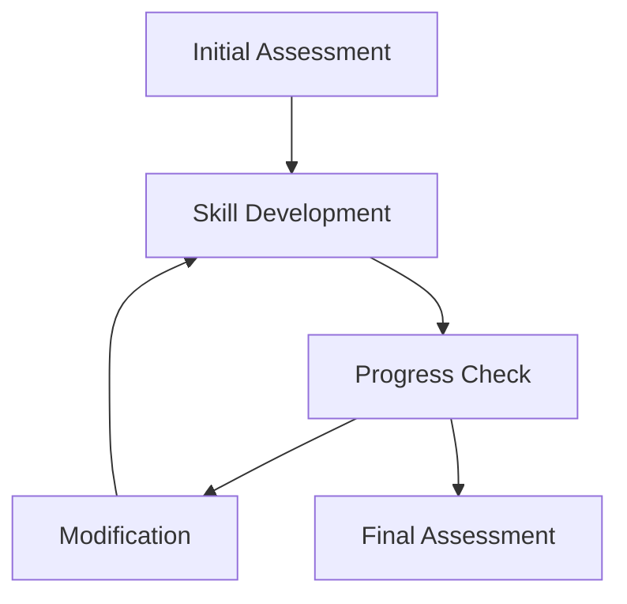
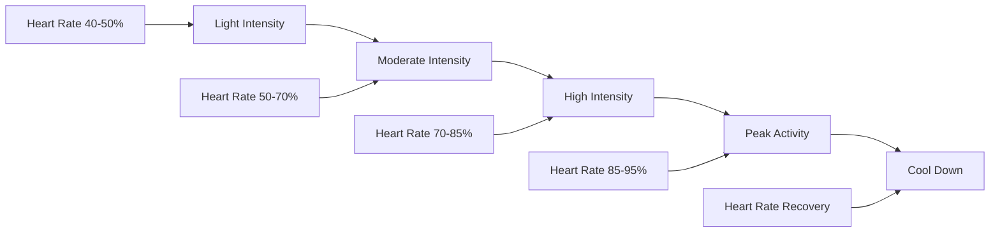
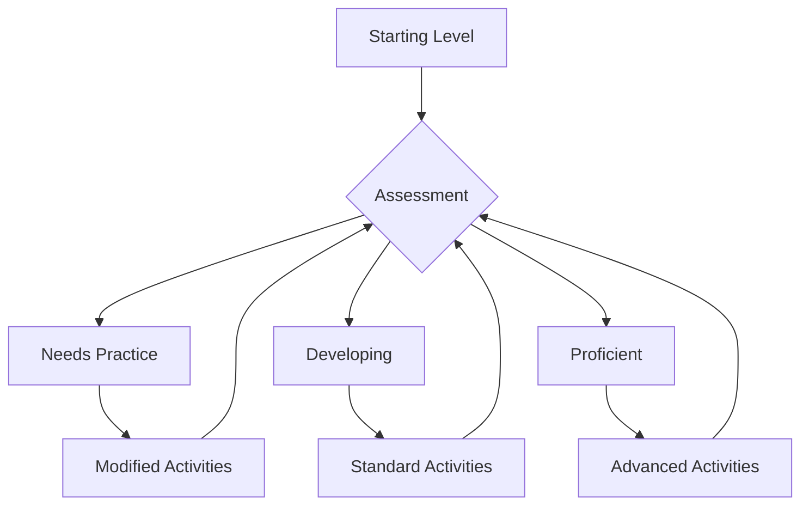
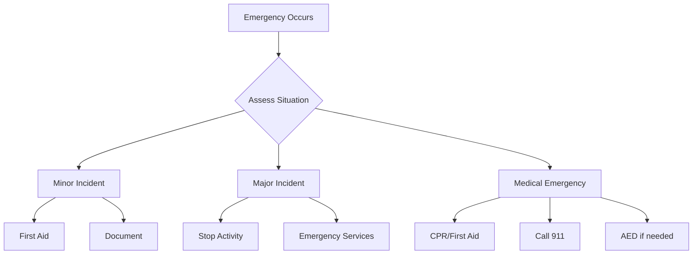

# Faraday PE System - Visual Guides

## Activity Category Relationships



## Skill Progression Maps

### Basketball Skills


### Volleyball Skills


## Space Setup Diagrams

### Basketball Station Setup
```
Court Layout:

[Shooting Station]     [Dribbling Station]
      🏀                     🏀
   👤  👤  👤            👤  👤  👤
      
[Passing Station]      [Game Station]
      🏀                     🏀
   👤  👤  👤         👤  👤  vs  👤  👤

Legend:
🏀 = Ball/Equipment
👤 = Student Position
```

### Volleyball Station Setup
```
Court Layout:

[Bumping Station]      [Setting Station]
      🏐                     🏐
   👤  👤  👤            👤  👤  👤
      
[Serving Station]      [Game Station]
      🏐                     🏐
   👤  👤  👤         👤  👤  vs  👤  👤

Net ===============================

Legend:
🏐 = Ball
👤 = Student Position
```

## Circuit Training Layouts

### Basic Circuit


### Advanced Circuit
```
Circuit Layout:

   [1]     [2]     [3]
    🔄  →   🔄  →   🔄
    ↑               ↓
   [6]     [5]     [4]
    🔄  ←   🔄  ←   🔄

Stations:
1. High Intensity
2. Skill Work
3. Power
4. Agility
5. Strength
6. Cardio
```

## Assessment Flow



## Safety Zone Setup

```
Facility Layout:

[First Aid Station]    [Equipment Zone]
    🏥  📱                  ⚽ 🏀 🏐
    
[Activity Space]       [Rest Area]
    🏃‍♂️ 🏃‍♀️              💧 🪑
    
[Emergency Exit]       [Teacher Station]
    🚪                     👨‍🏫 📋

Legend:
🏥 = First Aid
📱 = Emergency Phone
⚽ = Equipment
💧 = Water Station
🚪 = Exit
👨‍🏫 = Teacher Position
```

## Activity Intensity Progression



## Equipment Organization

```
Storage Layout:

[Ball Rack]           [Mat Storage]
🏀 🏐 ⚽              🟦 🟦 🟦
   
[Cone Storage]        [Equipment Bins]
🔺 🔺 🔺             📦 📦 📦

[Safety Equipment]    [Teaching Aids]
🎽 ⛑️ 🧰             📋 📱 📣

Legend:
🏀 = Balls
🟦 = Mats
🔺 = Cones
📦 = Mixed Equipment
⛑️ = Safety Gear
📋 = Teaching Materials
```

## Class Formation Patterns

### Group Formations
```
Circle Formation:        Lines Formation:
   👤 👤 👤               👤 👤 👤
 👤       👤             👤 👤 👤
👤    👨‍🏫    👤           👤 👤 👤
 👤       👤             👤 👤 👤
   👤 👤 👤               👨‍🏫

Stations Formation:      Game Formation:
👥 👥    👥 👥         👤 👤 vs 👤 👤
                       👤 👤 vs 👤 👤
👥 👥    👥 👥         👨‍🏫
```

## Progress Tracking Visual



## Emergency Response Map



## Beta Dashboard Visual References

For interactive visualizations and real-time monitoring in the beta dashboard, refer to:

- [Beta Documentation](/docs/beta/beta_documentation.md)
  - Dashboard interface guide
  - Visual analytics
  - Performance metrics

- [Monitoring and Feedback Setup](/docs/beta/monitoring_feedback_setup.md)
  - Real-time monitoring
  - Performance tracking
  - System health visualization

- [Beta User Onboarding Guide](/docs/beta/beta_user_onboarding.md)
  - Dashboard navigation
  - Feature visualization
  - Support resources 

## Related Documentation

### Core Documentation
- [Activity System](/docs/activity_system.md)
  - Complete activity descriptions
  - Category relationships
  - Implementation details
  - System architecture

- [Quick Reference Guide](/docs/quick_reference.md)
  - Activity type summaries
  - Quick modifications
  - Emergency procedures
  - Assessment guides

- [Assessment Framework](/docs/assessment_framework.md)
  - Assessment visualization
  - Progress tracking methods
  - Performance metrics
  - Reporting templates

- [Safety Protocols](/docs/safety_protocols.md)
  - Safety zone layouts
  - Equipment organization
  - Emergency procedures
  - Risk management

- [Lesson Plans](/docs/lesson_plans.md)
  - Space setup guides
  - Formation patterns
  - Teaching cues
  - Activity progressions

### Implementation and Technical Details
- [Activity Visualization Manager](/docs/activity_visualization_manager.md)
  - Interactive visualizations
  - Data representation
  - Performance tracking
  - Visual analytics

- [Dashboard Integration Context](/docs/context/dashboard-ai-integration-context.md)
  - Visual components
  - UI/UX implementation
  - System integration
  - Performance metrics

- [Dashboard Handoff](/docs/handoff/dashboard_handoff.md)
  - Visual interface details
  - System components
  - Implementation status
  - Deployment guidelines

- [User System Implementation](/docs/handoff/user_system_implementation.md)
  - User interface elements
  - System visualization
  - Integration patterns
  - Implementation details

### Beta Program Documentation
- [Beta Documentation](/docs/beta/beta_documentation.md)
  - Dashboard interface guide
  - Visual analytics
  - Performance metrics
  - System visualization

- [Monitoring Setup](/docs/beta/monitoring_feedback_setup.md)
  - Real-time monitoring
  - Performance tracking
  - System health visualization
  - Visual analytics

- [User Onboarding](/docs/beta/beta_user_onboarding.md)
  - Dashboard navigation
  - Feature visualization
  - Visual guides
  - Support resources

- [Pre-Beta Checklist](/docs/beta/pre_beta_checklist.md)
  - Visual validation
  - Interface testing
  - Documentation review
  - Feature verification 